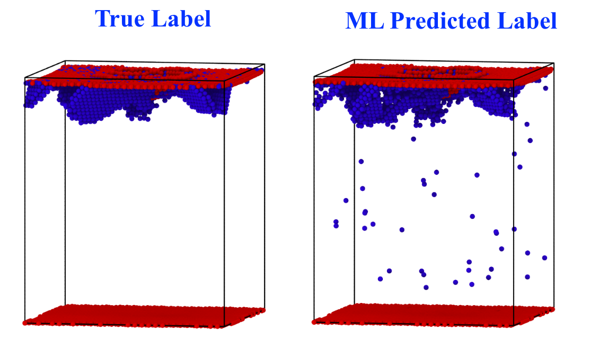

# ML-defect-analysis
Python-based Machine Learning tools to analyze damage in materials by classification of defects


## Building and Running ML tools

The following command uses the supplied `Makefile` to compile a supplementary tool that reads a .xyz structure file and converts it into a list of feature vectors. These feature vectors are the primary input for the main defect-classification ML program.

```
make
```

This compiles a new executable `c_feature`, which takes two arguments -- The first argument is the name of the .xyz file to be read. The second argument is the name of the file where the computed feature vectors are written out. Create a training set from the `Ni_train.xyz` file with the following command

```
./c_feature Ni_train.xyz feature/train.txt
```

Next, create a test set from the `Ni_test1.xyz` file with the following command

```
./c_feature Ni_test1.xyz feature/test_1.txt
```

Once we have the training and test datasets, we call the primary ML program `SVM_model.py` on the two files we just created using the following command

```
python SVM_model.py feature/train.txt feature/test_1.txt
```

The primary output of the ML program is the `output.xyz` file, which contains predicted and true labels for the different atoms. This file can be viewed in any atomistic visualization program to measure the accuracy of the ML classifier. In this example, we get >99% accuracy in defect classification, as shown below.



For more detailed information about the input data, feature vector construction and the Support Vector Model used for defect classification consult the slides from the MAGICS Workshop, `ML_Workshop_Slides.pdf` in the `training` folder.
